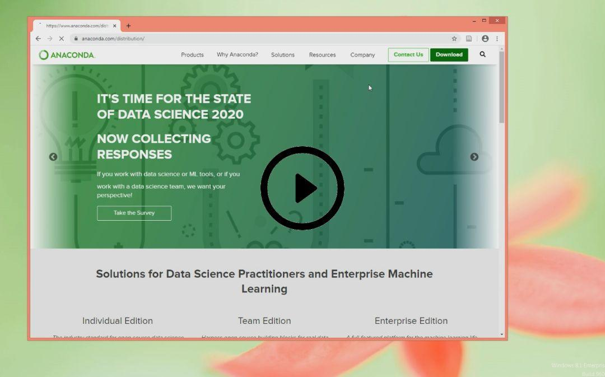

# MMedia
Multimedia Course

## Running on google colab
The simplest way to run these python scripts is google colab.

Simply click on provided each chapter google colab link to run a test codes.

* Chapter 1 

* Chapter 2 

* Chapter 3 .ipynb)

* Chapter 5-a .ipynp)

* Chapter 5-b .ipynb)

* Chapter 6 .ipynb)

* Chapter 7 .ipynb)

## Running on windows
* Download and install [anaconda](https://www.anaconda.com/distribution/)
* Create a new virtual environment
* Download This [repository](https://github.com/a-mansouri/MMS/archive/master.zip)
 compressed file and extract it.
* Install requirements

        pip install -r requirements.txt
        
* Install jupyter 
* Lunch jupyter notebook and run codes

This is a help video which show above instruction. 

Run a jupyter file

